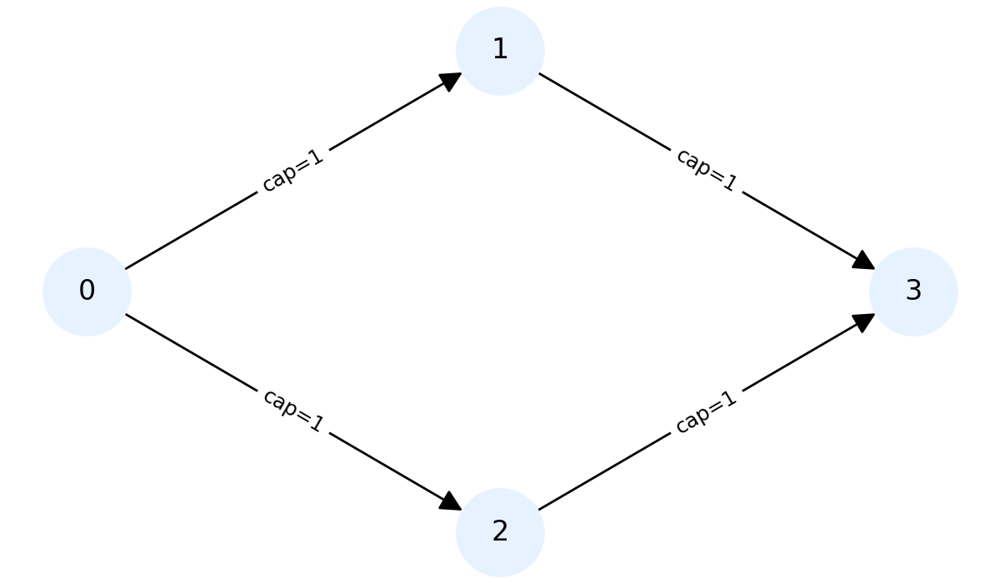
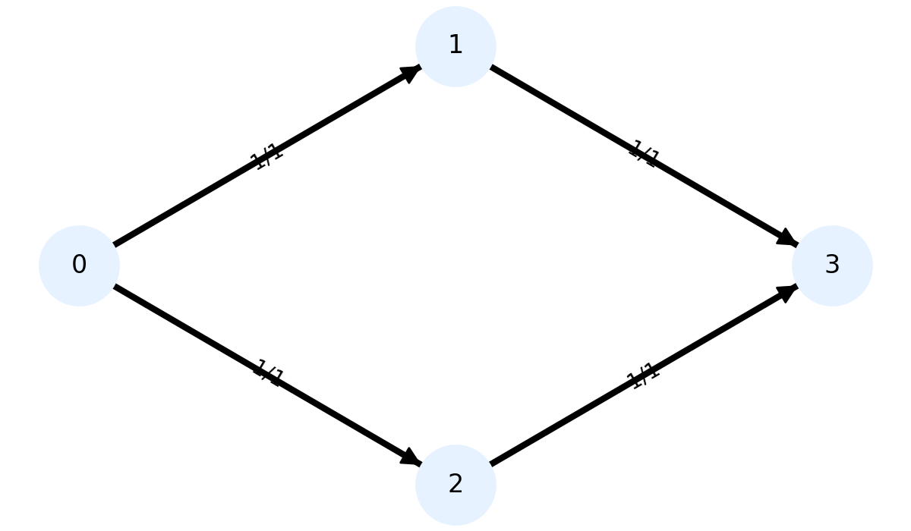
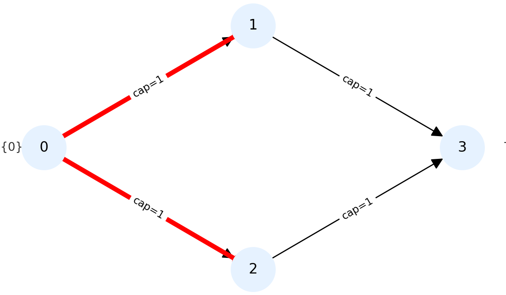
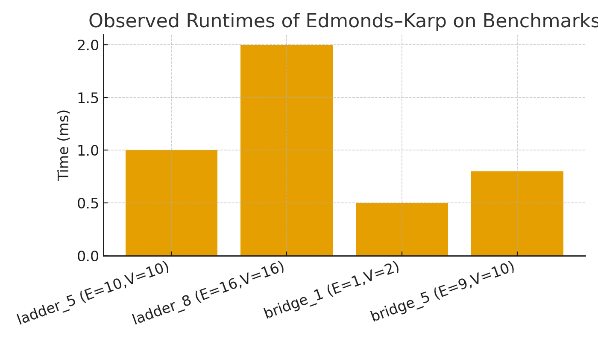
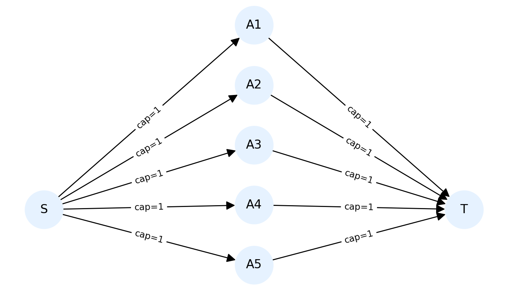
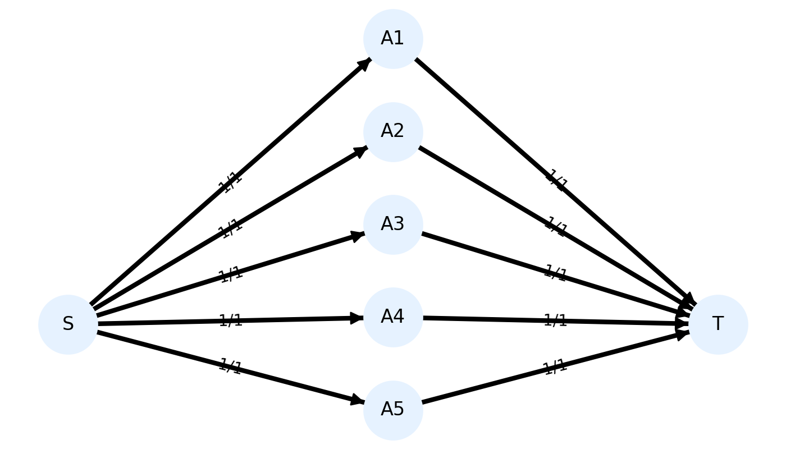
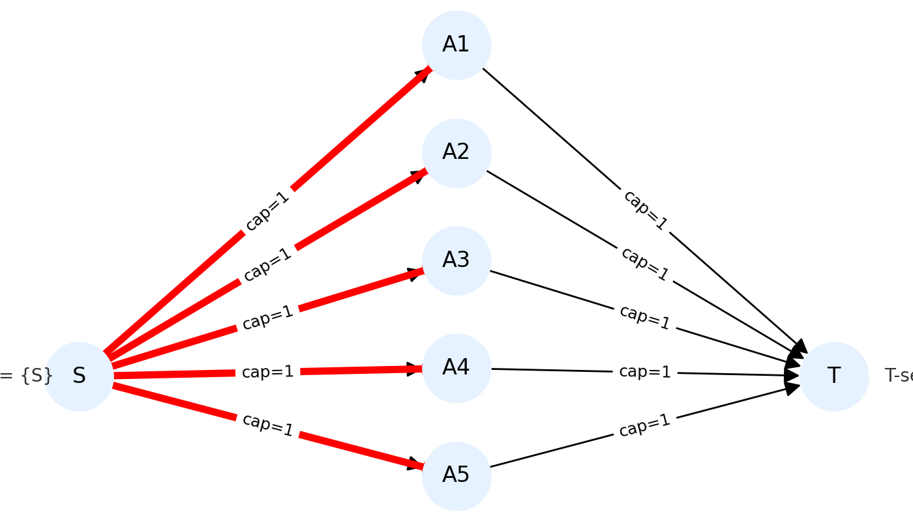
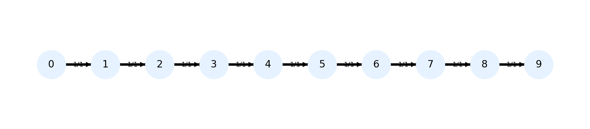
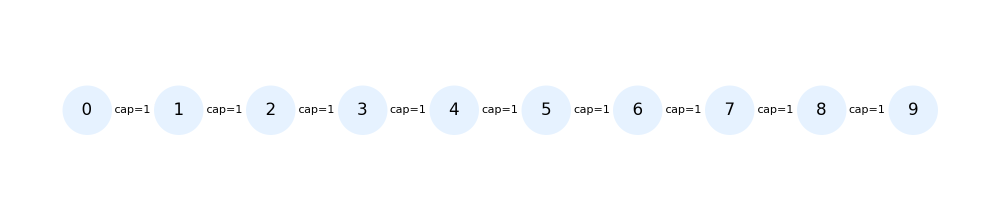

# Network Flow Algorithms

## Overview
This project explores the **algorithmic analysis of network flow problems**, with a focus on implementations, performance, and applications of classical graph algorithms.  
The aim is to study, implement, and evaluate different approaches to solving **Max-Flow / Min-Cut** problems, and to demonstrate their behaviour on benchmark graphs such as ladder and bridge networks.

## Assessment
This project was submitted as part of my **Algorithmic Theory and Design** coursework.

## Algorithms Implemented
- **Ford–Fulkerson Method**  
- **Edmonds–Karp Algorithm (BFS-based Ford–Fulkerson)**  
- **Push–Relabel Algorithm**  
- **Dinic’s Algorithm**  
- **Min-Cut Analysis**  

## Features
- **Implementation of max-flow and min-cut algorithms in Java**  
- **Efficient adjacency list representation for sparse graphs**  
- **Analysis of algorithmic complexity and scaling behaviour**  
- **Benchmark tests on ladder and bridge graphs**  
- **Visualisations of flows, cuts, and BFS levels**  

## Tech Stack
- **Language:** Java  
- **Libraries/Tools:** Matplotlib & NetworkX (for visualisation), Git & GitHub  

---

## Results Summary
- **Edmonds–Karp correctly computes max-flow and min-cut values** on ladder and bridge benchmarks.  
- **Observed runtimes scale close to O(E·V)** on layered, unit-capacity graphs, despite the O(V·E²) theoretical bound.  
- **Ladder graphs show linear scaling** with the number of rungs, while **bridge graphs complete in a single BFS**.  

---

## How to Run

1. **Clone the repository**
  
   git clone https://github.com/your-username/network-flow-algorithms.git
   cd network-flow-algorithms

2. **Compile the Java sources**
   
  javac *.java

3. **Run the program with a sample input file**
   java App inputs/ladder_2.txt
   **Example output**

Augmenting path: 0 → 1 → 3, bottleneck = 1
Augmenting path: 0 → 2 → 3, bottleneck = 1
Maximum flow = 2

4. **Try with other benchmarks (e.g., ladder_5.txt, ladder_8.txt, bridge_5.txt)**

java App inputs/ladder_5.txt

## Examples

### Ladder_2 (unit capacities)

**Initial network**  

**Final flow (Edmonds–Karp)**  
Two disjoint s–t paths each carry 1 unit → max flow = 2.  

**Min cut**  
One min cut is S={0}, T={1,2,3}; cut edges are (0→1) and (0→2), total capacity = 2.  

---

### Performance (Observed)

Small benchmarks align with ~O(E·V) behaviour on unit-capacity, layered graphs.  

---

### Ladder_5 (unit capacities)

**Initial network**  

**Final flow (Edmonds–Karp)**  
Five disjoint s–t paths each carry 1 unit → max flow = 5.  

**Min cut**  
Cutting all edges out of S has total capacity 5, matching the max flow.  

**BFS levels in Edmonds–Karp**  
The graph layers into 3 levels:  
- **Level 0:** Source  
- **Level 1:** Intermediate nodes (A1…A5)  
- **Level 2:** Sink  

Each augmentation follows one shortest s–t path, so the algorithm terminates after 5 augmentations (one per path).  

---

### Bridge_5 (single-path benchmark)

**Initial network**  

**Final flow (Edmonds–Karp)**  
Single s–t path saturates at 1 unit → max flow = 1.  

**Min cut**  
Any single edge on the path forms a min cut (capacity = 1). Example: cut between 0 and 1.  

---

## Future Improvements
- **Extend benchmarks** to larger ladder and bridge graphs  
- **Add random graph generators** for stress-testing  
- **Compare performance** with parallel/distributed implementations  
- **Explore real-world applications** (routing, scheduling, resource allocation)  

---

## Acknowledgement
Developed as part of coursework on **Algorithmic Theory and Design**.  
This project was awarded **86% (First Class)**.
